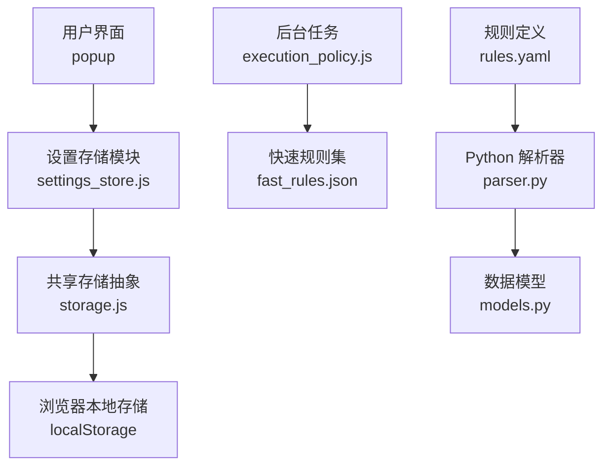
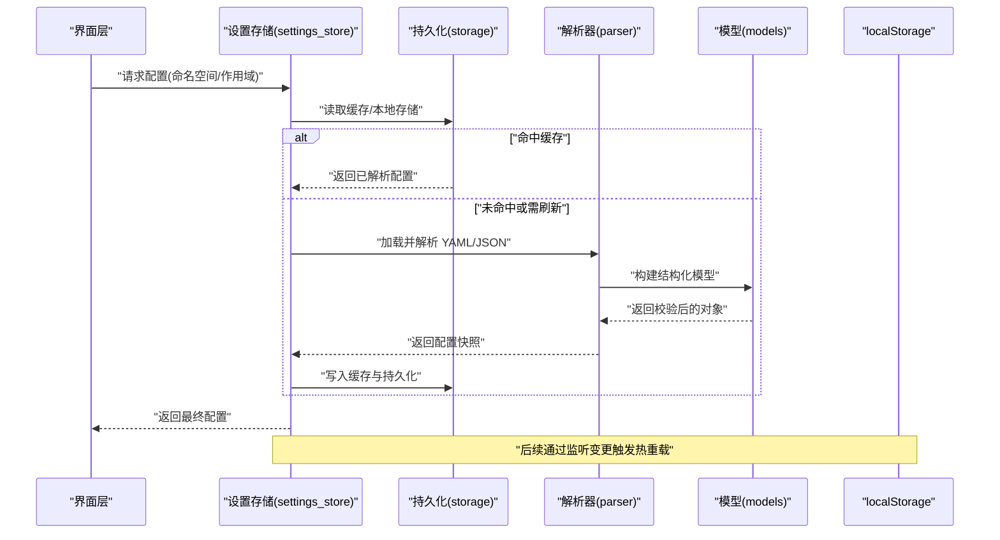
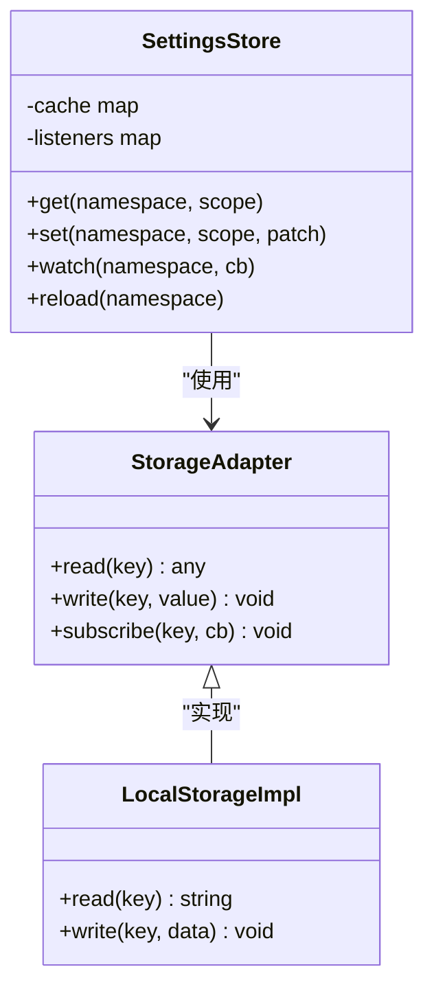
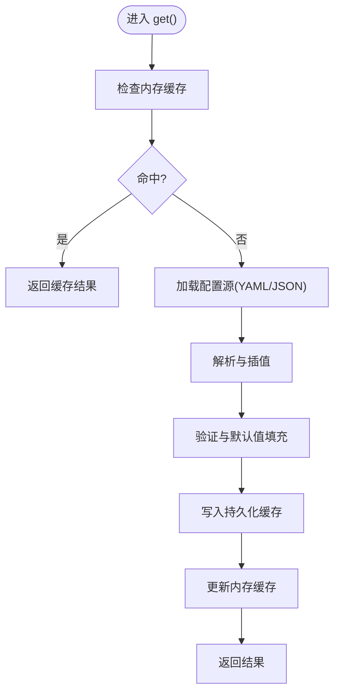
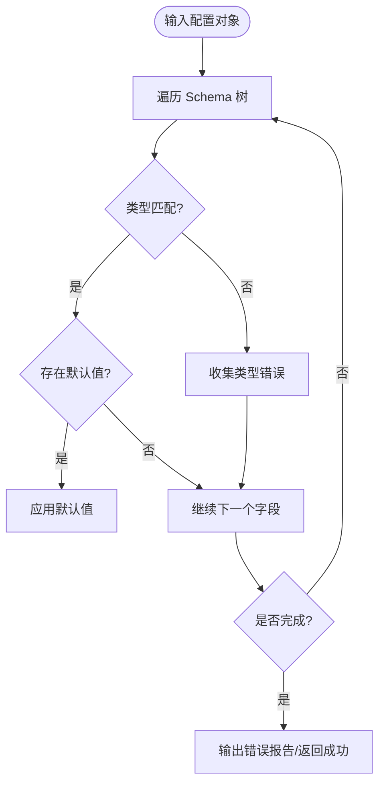
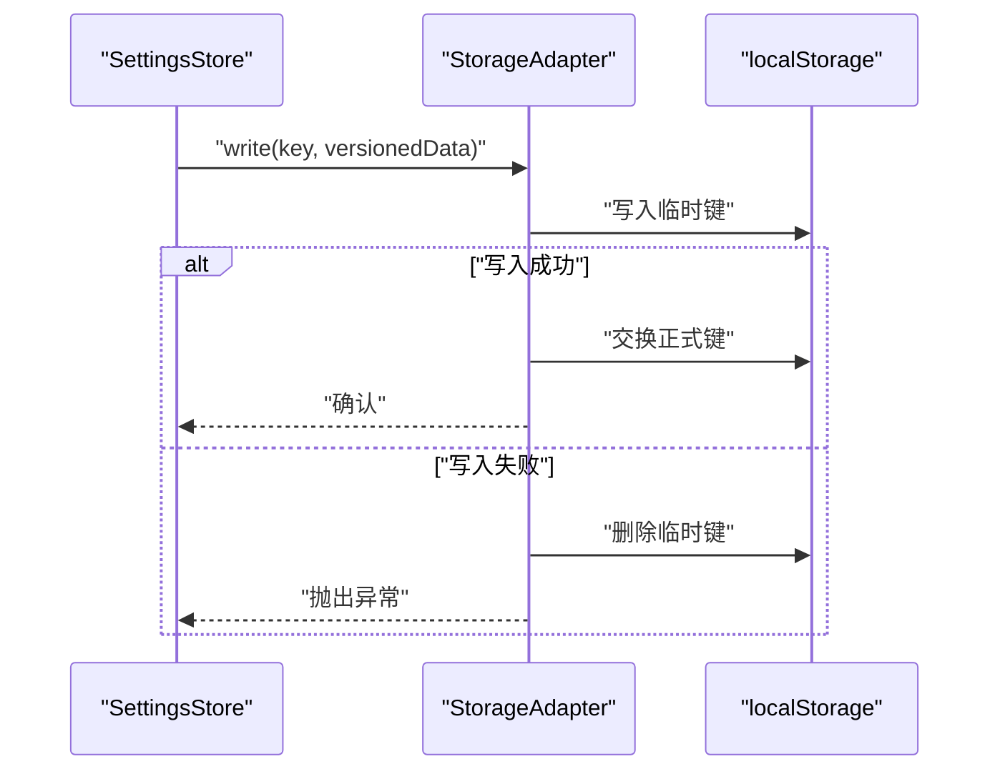
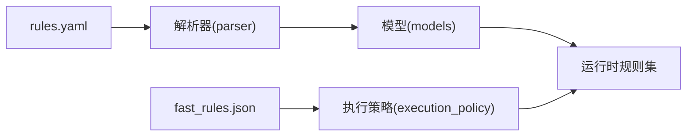
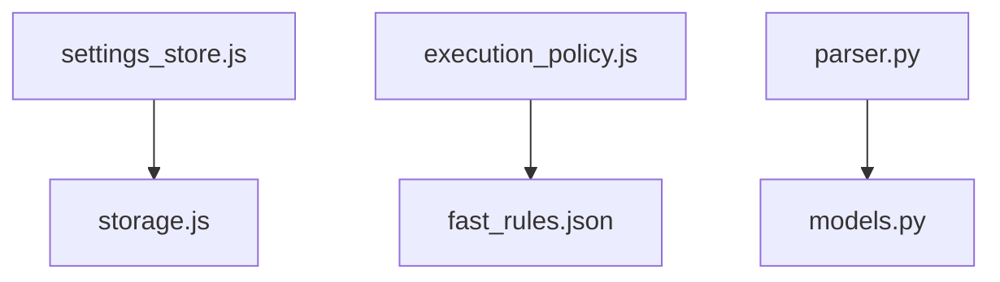

# 配置管理架构

<cite>
**本文引用的文件**   
- [config/rules.yaml](file://config/rules.yaml)
- [extension/shared/storage.js](file://extension/shared/storage.js)
- [extension/popup/settings_store.js](file://extension/popup/settings_store.js)
- [extension/background/execution_policy.js](file://extension/background/execution_policy.js)
- [extension/fast_rules.json](file://extension/fast_rules.json)
- [src/bookmark_advisor/parser.py](file://src/bookmark_advisor/parser.py)
- [src/bookmark_advisor/models.py](file://src/bookmark_advisor/models.py)
- [tests/test_extension_popup_settings_store.js](file://tests/test_extension_popup_settings_store.js)
</cite>

## 目录
1. [简介](#简介)
2. [项目结构](#项目结构)
3. [核心组件](#核心组件)
4. [架构总览](#架构总览)
5. [详细组件分析](#详细组件分析)
6. [依赖关系分析](#依赖关系分析)
7. [性能考虑](#性能考虑)
8. [故障排查指南](#故障排查指南)
9. [结论](#结论)
10. [附录：配置语法参考与最佳实践](#附录配置语法参考与最佳实践)

## 简介
本文件围绕“集中式配置存储”的架构进行系统化说明，覆盖配置的层次结构与命名空间、作用域管理、动态加载（懒加载、缓存、热重载）、验证框架（类型检查、默认值、错误报告）、持久化方案（localStorage、序列化、版本兼容），以及配置文件语法（YAML 规范、变量插值、条件配置）和最佳实践。文档同时结合仓库中现有实现，给出可落地的设计建议与优化策略。

## 项目结构
从仓库视角看，配置相关的关键位置包括：
- 规则与静态配置：config/rules.yaml、extension/fast_rules.json
- 浏览器扩展侧持久化与设置：extension/shared/storage.js、extension/popup/settings_store.js
- 后台执行策略读取：extension/background/execution_policy.js
- Python 端解析与模型：src/bookmark_advisor/parser.py、src/bookmark_advisor/models.py
- 测试用例：tests/test_extension_popup_settings_store.js

图表来源
- [extension/popup/settings_store.js](file://extension/popup/settings_store.js)
- [extension/shared/storage.js](file://extension/shared/storage.js)
- [extension/background/execution_policy.js](file://extension/background/execution_policy.js)
- [extension/fast_rules.json](file://extension/fast_rules.json)
- [src/bookmark_advisor/parser.py](file://src/bookmark_advisor/parser.py)
- [src/bookmark_advisor/models.py](file://src/bookmark_advisor/models.py)
- [config/rules.yaml](file://config/rules.yaml)

章节来源
- [extension/popup/settings_store.js](file://extension/popup/settings_store.js)
- [extension/shared/storage.js](file://extension/shared/storage.js)
- [extension/background/execution_policy.js](file://extension/background/execution_policy.js)
- [extension/fast_rules.json](file://extension/fast_rules.json)
- [src/bookmark_advisor/parser.py](file://src/bookmark_advisor/parser.py)
- [src/bookmark_advisor/models.py](file://src/bookmark_advisor/models.py)
- [config/rules.yaml](file://config/rules.yaml)

## 核心组件
- 集中式配置存储
  - 职责：提供统一的配置访问接口，维护命名空间与作用域，负责懒加载、缓存与热重载。
  - 关键能力：按命名空间隔离配置；按作用域（全局/页面/会话）合并优先级；变更事件广播。
- 持久化层
  - 职责：将配置序列化为字符串并写入 localStorage，处理版本迁移与兼容性。
  - 关键能力：读写封装、增量更新、失败回退。
- 验证框架
  - 职责：在加载时校验配置结构、类型与约束，生成错误报告，应用默认值。
  - 关键能力：Schema 驱动、字段级错误聚合、可恢复降级。
- 动态加载机制
  - 职责：按需加载配置片段，支持热重载与缓存失效。
  - 关键能力：懒加载入口、缓存键设计、监听外部变更。
- 规则与静态配置
  - 职责：提供 YAML/JSON 形式的规则与常量，供运行时解析与注入。
  - 关键能力：YAML 解析、变量插值、条件分支。

章节来源
- [extension/popup/settings_store.js](file://extension/popup/settings_store.js)
- [extension/shared/storage.js](file://extension/shared/storage.js)
- [extension/background/execution_policy.js](file://extension/background/execution_policy.js)
- [extension/fast_rules.json](file://extension/fast_rules.json)
- [src/bookmark_advisor/parser.py](file://src/bookmark_advisor/parser.py)
- [src/bookmark_advisor/models.py](file://src/bookmark_advisor/models.py)
- [config/rules.yaml](file://config/rules.yaml)

## 架构总览
下图展示配置从静态源到运行时的整体流程，包括解析、验证、持久化与热重载路径。

图表来源
- [extension/popup/settings_store.js](file://extension/popup/settings_store.js)
- [extension/shared/storage.js](file://extension/shared/storage.js)
- [src/bookmark_advisor/parser.py](file://src/bookmark_advisor/parser.py)
- [src/bookmark_advisor/models.py](file://src/bookmark_advisor/models.py)

## 详细组件分析

### 组件一：集中式配置存储（命名空间与作用域）
- 设计要点
  - 命名空间：以功能域为维度划分配置（如“规则”、“界面”、“网络”）。
  - 作用域：支持“全局/页面/会话”三级作用域，合并顺序为“全局 < 页面 < 会话”。
  - 懒加载：首次访问某命名空间时才加载对应资源。
  - 缓存：内存缓存 + 持久化缓存双缓冲，避免重复 IO。
  - 热重载：监听配置源变更，自动失效缓存并重新加载。
- 关键接口（概念性）
  - get(namespace, scope)
  - set(namespace, scope, patch)
  - watch(namespace, callback)
  - reload(namespace)
- 与现有代码的映射
  - 设置存储模块负责暴露统一 API 并与持久化层交互。
  - 持久化层封装 localStorage 读写与序列化。

图表来源
- [extension/popup/settings_store.js](file://extension/popup/settings_store.js)
- [extension/shared/storage.js](file://extension/shared/storage.js)

章节来源
- [extension/popup/settings_store.js](file://extension/popup/settings_store.js)
- [extension/shared/storage.js](file://extension/shared/storage.js)

### 组件二：动态加载机制（懒加载、缓存、热重载）
- 懒加载
  - 仅在首次访问命名空间时触发加载，减少启动开销。
- 缓存策略
  - 内存缓存：进程内 Map，键为“命名空间+作用域+版本”。
  - 持久化缓存：写入 localStorage，避免重启后丢失。
  - 失效策略：版本号变化或显式 reload 触发失效。
- 热重载
  - 监听配置源变更事件，通知订阅者并重建缓存。
  - 支持部分更新（patch）与全量替换两种模式。

图表来源
- [extension/popup/settings_store.js](file://extension/popup/settings_store.js)
- [extension/shared/storage.js](file://extension/shared/storage.js)

章节来源
- [extension/popup/settings_store.js](file://extension/popup/settings_store.js)
- [extension/shared/storage.js](file://extension/shared/storage.js)

### 组件三：验证框架（类型检查、默认值、错误报告）
- 类型检查
  - 基于 Schema 对字段类型、枚举、范围进行校验。
- 默认值处理
  - 缺失字段按 Schema 默认值补齐，保证下游稳定。
- 错误报告
  - 收集所有字段错误，返回结构化错误列表，便于 UI 提示。
- 与现有代码的映射
  - Python 端 parser 与 models 体现了解析与模型化的思路，可作为 JS 端验证框架的设计参考。

图表来源
- [src/bookmark_advisor/parser.py](file://src/bookmark_advisor/parser.py)
- [src/bookmark_advisor/models.py](file://src/bookmark_advisor/models.py)

章节来源
- [src/bookmark_advisor/parser.py](file://src/bookmark_advisor/parser.py)
- [src/bookmark_advisor/models.py](file://src/bookmark_advisor/models.py)

### 组件四：持久化存储（localStorage、序列化、版本兼容）
- 序列化
  - 将配置对象序列化为 JSON 字符串，确保可逆与可读。
- 版本兼容
  - 引入配置版本字段，迁移逻辑在读取时执行，保证向后兼容。
- 原子性与回退
  - 先写临时键再交换，失败时回滚至旧值。
- 与现有代码的映射
  - storage.js 提供通用读写封装，settings_store.js 调用其接口完成持久化。

图表来源
- [extension/shared/storage.js](file://extension/shared/storage.js)
- [extension/popup/settings_store.js](file://extension/popup/settings_store.js)

章节来源
- [extension/shared/storage.js](file://extension/shared/storage.js)
- [extension/popup/settings_store.js](file://extension/popup/settings_store.js)

### 组件五：规则与静态配置（YAML/JSON）
- YAML 规则
  - 用于描述规则集合、条件与参数，配合解析器注入到运行时。
- JSON 快速规则
  - 轻量级规则集，适合高频读取场景。
- 与现有代码的映射
  - rules.yaml 作为规则源；fast_rules.json 作为快速规则；execution_policy.js 读取并使用。

图表来源
- [config/rules.yaml](file://config/rules.yaml)
- [extension/fast_rules.json](file://extension/fast_rules.json)
- [src/bookmark_advisor/parser.py](file://src/bookmark_advisor/parser.py)
- [src/bookmark_advisor/models.py](file://src/bookmark_advisor/models.py)
- [extension/background/execution_policy.js](file://extension/background/execution_policy.js)

章节来源
- [config/rules.yaml](file://config/rules.yaml)
- [extension/fast_rules.json](file://extension/fast_rules.json)
- [extension/background/execution_policy.js](file://extension/background/execution_policy.js)
- [src/bookmark_advisor/parser.py](file://src/bookmark_advisor/parser.py)
- [src/bookmark_advisor/models.py](file://src/bookmark_advisor/models.py)

## 依赖关系分析
- 组件耦合
  - settings_store.js 依赖 storage.js 提供的持久化能力。
  - execution_policy.js 依赖 fast_rules.json 的规则数据。
  - parser.py 与 models.py 形成解析-模型闭环，为前端验证框架提供参考。
- 外部依赖
  - localStorage 作为浏览器端持久化后端。
  - YAML/JSON 解析库（由各自语言生态提供）。

图表来源
- [extension/popup/settings_store.js](file://extension/popup/settings_store.js)
- [extension/shared/storage.js](file://extension/shared/storage.js)
- [extension/background/execution_policy.js](file://extension/background/execution_policy.js)
- [extension/fast_rules.json](file://extension/fast_rules.json)
- [src/bookmark_advisor/parser.py](file://src/bookmark_advisor/parser.py)
- [src/bookmark_advisor/models.py](file://src/bookmark_advisor/models.py)

章节来源
- [extension/popup/settings_store.js](file://extension/popup/settings_store.js)
- [extension/shared/storage.js](file://extension/shared/storage.js)
- [extension/background/execution_policy.js](file://extension/background/execution_policy.js)
- [extension/fast_rules.json](file://extension/fast_rules.json)
- [src/bookmark_advisor/parser.py](file://src/bookmark_advisor/parser.py)
- [src/bookmark_advisor/models.py](file://src/bookmark_advisor/models.py)

## 性能考虑
- 懒加载与按需解析
  - 仅在实际使用时加载配置，降低首屏开销。
- 多级缓存
  - 内存缓存优先，持久化缓存兜底，减少 IO 次数。
- 增量更新
  - 支持 patch 更新，避免全量重算与重序列化。
- 批量订阅
  - 合并多次变更事件，减少 UI 重渲染。
- 规则预编译
  - 对复杂规则进行预编译或索引，提升运行时匹配效率。

[本节为通用性能建议，不直接分析具体文件]

## 故障排查指南
- 常见问题
  - 配置未生效：检查命名空间与作用域是否正确；确认缓存是否过期。
  - 类型错误：查看验证错误报告，定位具体字段与期望类型。
  - 持久化失败：检查 localStorage 配额与权限；确认序列化格式。
- 定位步骤
  - 在设置存储层增加日志，记录 key、version、payload 大小。
  - 对比前后两次配置 diff，确认是否为增量导致的不一致。
  - 使用单元测试复现问题，聚焦最小可复现场景。

章节来源
- [tests/test_extension_popup_settings_store.js](file://tests/test_extension_popup_settings_store.js)

## 结论
本架构通过“集中式配置存储 + 分层作用域 + 动态加载 + 强验证 + 持久化”的组合，实现了高可用、可扩展且易维护的配置体系。结合懒加载与多级缓存，可在保证性能的同时提供热重载能力；借助验证框架与错误报告，显著提升配置质量与可观测性。建议在后续迭代中完善 Schema 驱动与迁移工具链，进一步提升工程化水平。

## 附录：配置语法参考与最佳实践

### YAML 配置语法参考
- 基本结构
  - 使用缩进表示层级，键值对采用冒号分隔。
- 数据类型
  - 支持标量（字符串、数字、布尔）、数组、映射。
- 注释
  - 以 # 开头整行注释。
- 示例（概念性）
  - 顶层命名空间下包含若干子项，每个子项具备类型与默认值说明。

章节来源
- [config/rules.yaml](file://config/rules.yaml)

### 变量插值
- 语法
  - 使用占位符引用环境变量或上下文变量。
- 作用域
  - 插值可按作用域解析，优先使用更具体的作用域值。
- 安全
  - 禁止在不可信上下文中执行任意表达式，仅允许白名单变量。

章节来源
- [config/rules.yaml](file://config/rules.yaml)

### 条件配置
- 语法
  - 基于环境、平台或运行时特征选择不同配置分支。
- 优先级
  - 条件满足时采用对应分支，否则回退到默认分支。
- 示例（概念性）
  - 当处于调试环境时启用详细日志；生产环境关闭冗余输出。

章节来源
- [config/rules.yaml](file://config/rules.yaml)

### 最佳实践
- 命名规范
  - 命名空间采用小写下划线，作用域明确区分。
- 版本管理
  - 每次破坏性变更递增版本，并提供迁移脚本。
- 默认值
  - 为所有可选字段提供合理默认值，避免空指针。
- 错误处理
  - 严格校验并返回详细错误信息，便于快速定位。
- 性能
  - 大配置分片加载，热点配置常驻内存。
- 安全
  - 敏感信息走密钥管理服务，不在配置文件中明文存放。

[本节为通用最佳实践，不直接分析具体文件]