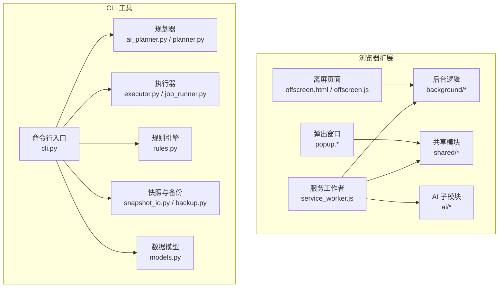
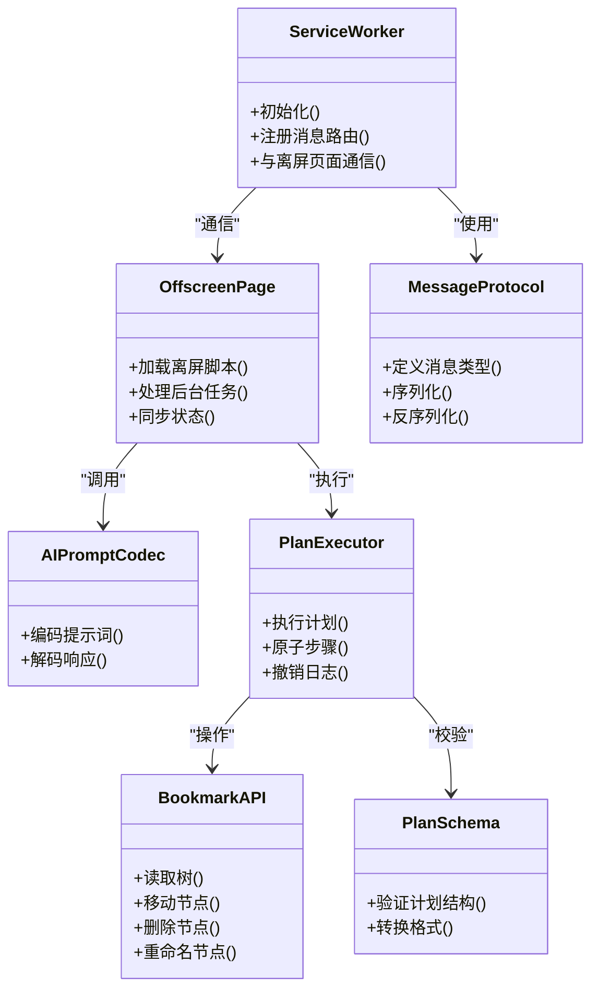
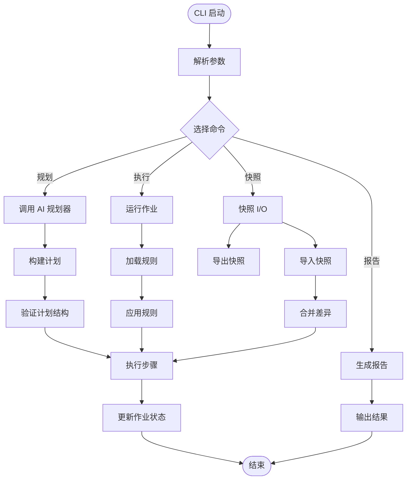
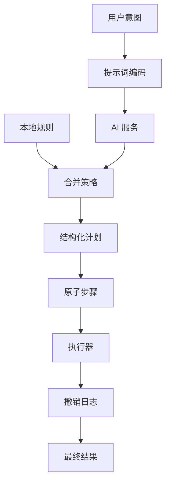
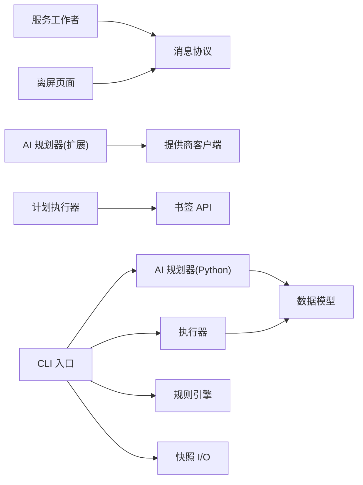

# 项目概述

<cite>
**本文引用的文件**   
- [README.md](file://README.md)
- [manifest.json](file://extension/manifest.json)
- [service_worker.js](file://extension/service_worker.js)
- [offscreen.html](file://extension/offscreen.html)
- [offscreen.js](file://extension/offscreen.js)
- [ai_planner.js](file://extension/ai_planner.js)
- [plan_executor.js](file://extension/background/plan_executor.js)
- [job_handlers.js](file://extension/background/job_handlers.js)
- [bookmark_api.js](file://extension/background/bookmark_api.js)
- [message_protocol.js](file://extension/shared/message_protocol.js)
- [plan_schema.js](file://extension/shared/plan_schema.js)
- [fast_rules.js](file://extension/ai/fast_rules.js)
- [prompt_codec.js](file://extension/ai/prompt_codec.js)
- [response_codec.js](file://extension/ai/response_codec.js)
- [provider_client.js](file://extension/ai/provider_client.js)
- [batching.js](file://extension/ai/batching.js)
- [snapshot_model.js](file://extension/ai/snapshot_model.js)
- [cli.py](file://src/bookmark_advisor/cli.py)
- [ai_planner.py](file://src/bookmark_advisor/ai_planner.py)
- [planner.py](file://src/bookmark_advisor/planner.py)
- [executor.py](file://src/bookmark_advisor/executor.py)
- [job_runner.py](file://src/bookmark_advisor/job_runner.py)
- [models.py](file://src/bookmark_advisor/models.py)
- [rules.py](file://src/bookmark_advisor/rules.py)
- [backup.py](file://src/bookmark_advisor/backup.py)
- [snapshot_io.py](file://src/bookmark_advisor/snapshot_io.py)
- [reporting.py](file://src/bookmark_advisor/reporting.py)
- [pyproject.toml](file://pyproject.toml)
</cite>

## 目录
1. [简介](#简介)
2. [项目结构](#项目结构)
3. [核心组件](#核心组件)
4. [架构总览](#架构总览)
5. [详细组件分析](#详细组件分析)
6. [依赖关系分析](#依赖关系分析)
7. [性能考虑](#性能考虑)
8. [故障排查指南](#故障排查指南)
9. [结论](#结论)
10. [附录](#附录)

## 简介
Edge Bookmark 是一个混合应用项目，包含浏览器扩展与 Python CLI 工具，专注于 AI 驱动的书签智能重组与管理。其核心价值主张在于：通过“计划驱动”的工作流，将复杂的书签整理任务拆解为可执行、可回滚、可审计的步骤；借助多代理协作机制与插件化系统，实现跨端一致的智能规划与执行体验。

主要特性概览：
- 浏览器扩展侧：提供用户界面、消息路由、后台任务编排、AI 提示词编解码、批量处理、快照模型等能力。
- CLI 工具侧：提供命令行入口、AI 规划器、规则引擎、执行器、作业运行器、备份与快照 I/O、报告生成等能力。
- 统一协议与模式：前后端共享消息协议与计划模式，确保两端在语义与数据结构上保持一致。
- 多代理协作：通过服务工作者与离屏页面协同，结合外部 AI 提供商客户端，形成可扩展的多代理工作流。
- 插件化系统：以技能（skills）与快速规则（fast rules）为核心，支持按场景扩展行为。

使用场景示例：
- 一键对大量书签进行智能分类与重组织。
- 基于 URL 语义的审查与去重建议。
- 离线或受限网络环境下，通过快照与本地规则完成基础重组。
- 在 CI/CD 或自动化流程中，通过 CLI 批量执行书签治理任务。

## 项目结构
仓库采用前后端分离与模块化组织方式：
- extension：浏览器扩展代码，包含服务工作者、离屏页面、弹出窗口、共享模块与 AI 子模块。
- src：Python 包 bookmark_advisor，包含 CLI、规划器、执行器、模型、规则、备份与快照等。
- skills：技能定义，描述特定任务的输入输出与参考契约。
- tests：覆盖扩展与 CLI 的测试用例。
- config：全局配置与规则。
- docs：设计文档与审计记录。

图表来源
- [service_worker.js](file://extension/service_worker.js)
- [offscreen.html](file://extension/offscreen.html)
- [offscreen.js](file://extension/offscreen.js)
- [message_protocol.js](file://extension/shared/message_protocol.js)
- [plan_schema.js](file://extension/shared/plan_schema.js)
- [ai_planner.js](file://extension/ai_planner.js)
- [plan_executor.js](file://extension/background/plan_executor.js)
- [job_handlers.js](file://extension/background/job_handlers.js)
- [bookmark_api.js](file://extension/background/bookmark_api.js)
- [fast_rules.js](file://extension/ai/fast_rules.js)
- [prompt_codec.js](file://extension/ai/prompt_codec.js)
- [response_codec.js](file://extension/ai/response_codec.js)
- [provider_client.js](file://extension/ai/provider_client.js)
- [batching.js](file://extension/ai/batching.js)
- [snapshot_model.js](file://extension/ai/snapshot_model.js)
- [cli.py](file://src/bookmark_advisor/cli.py)
- [ai_planner.py](file://src/bookmark_advisor/ai_planner.py)
- [planner.py](file://src/bookmark_advisor/planner.py)
- [executor.py](file://src/bookmark_advisor/executor.py)
- [job_runner.py](file://src/bookmark_advisor/job_runner.py)
- [models.py](file://src/bookmark_advisor/models.py)
- [rules.py](file://src/bookmark_advisor/rules.py)
- [backup.py](file://src/bookmark_advisor/backup.py)
- [snapshot_io.py](file://src/bookmark_advisor/snapshot_io.py)

章节来源
- [manifest.json](file://extension/manifest.json)
- [pyproject.toml](file://pyproject.toml)

## 核心组件
- 浏览器扩展
  - 服务工作者：负责生命周期管理、消息分发、与离屏页面通信。
  - 离屏页面：承载耗时任务与后台操作，避免阻塞 UI。
  - 弹出窗口：用户交互入口，展示计划与状态。
  - 共享模块：消息协议与计划模式，保证前后端一致性。
  - AI 子模块：提示词编解码、响应解析、批量请求、快照模型、快速规则与提供商客户端。
  - 后台逻辑：计划执行、作业生命周期、书签 API 封装、撤销日志等。
- CLI 工具
  - 命令行入口：参数解析与命令调度。
  - AI 规划器：调用外部 AI 服务生成重组计划。
  - 规划器与执行器：本地规则与策略驱动的计划构建与执行。
  - 作业运行器：任务编排、重试与状态跟踪。
  - 规则引擎：快速规则与通用规则匹配。
  - 快照与备份：导入导出、增量差异与恢复。
  - 报告：执行结果与统计信息输出。

章节来源
- [service_worker.js](file://extension/service_worker.js)
- [offscreen.html](file://extension/offscreen.html)
- [offscreen.js](file://extension/offscreen.js)
- [message_protocol.js](file://extension/shared/message_protocol.js)
- [plan_schema.js](file://extension/shared/plan_schema.js)
- [ai_planner.js](file://extension/ai_planner.js)
- [plan_executor.js](file://extension/background/plan_executor.js)
- [job_handlers.js](file://extension/background/job_handlers.js)
- [bookmark_api.js](file://extension/background/bookmark_api.js)
- [fast_rules.js](file://extension/ai/fast_rules.js)
- [prompt_codec.js](file://extension/ai/prompt_codec.js)
- [response_codec.js](file://extension/ai/response_codec.js)
- [provider_client.js](file://extension/ai/provider_client.js)
- [batching.js](file://extension/ai/batching.js)
- [snapshot_model.js](file://extension/ai/snapshot_model.js)
- [cli.py](file://src/bookmark_advisor/cli.py)
- [ai_planner.py](file://src/bookmark_advisor/ai_planner.py)
- [planner.py](file://src/bookmark_advisor/planner.py)
- [executor.py](file://src/bookmark_advisor/executor.py)
- [job_runner.py](file://src/bookmark_advisor/job_runner.py)
- [models.py](file://src/bookmark_advisor/models.py)
- [rules.py](file://src/bookmark_advisor/rules.py)
- [backup.py](file://src/bookmark_advisor/backup.py)
- [snapshot_io.py](file://src/bookmark_advisor/snapshot_io.py)
- [reporting.py](file://src/bookmark_advisor/reporting.py)

## 架构总览
整体采用前后端分离与插件化架构：
- 前端（浏览器扩展）负责用户交互、计划可视化、消息路由与后台任务协调。
- 后端（CLI）提供离线规划、规则执行、作业管理与报告输出。
- 共享层（消息协议与计划模式）确保两端在数据结构与语义上对齐。
- AI 层通过提供商客户端与外部大模型服务集成，支持提示词编解码与响应解析。
- 插件化系统通过技能与快速规则扩展行为，支持按场景定制。

```mermaid
sequenceDiagram
participant User as "用户"
participant Popup as "弹出窗口"
participant SW as "服务工作者"
participant Offscreen as "离屏页面"
participant Planner as "AI 规划器"
participant Provider as "AI 提供商客户端"
participant Executor as "计划执行器"
participant Bookmarks as "书签 API"
User->>Popup : "触发重组任务"
Popup->>SW : "发送创建计划消息"
SW->>Offscreen : "转发到离屏页面"
Offscreen->>Planner : "请求生成计划"
Planner->>Provider : "调用外部 AI 服务"
Provider-->>Planner : "返回结构化响应"
Planner-->>Offscreen : "生成计划对象"
Offscreen->>Executor : "提交执行作业"
Executor->>Bookmarks : "执行步骤移动/删除/重命名"
Bookmarks-->>Executor : "返回执行结果"
Executor-->>Offscreen : "更新作业状态"
Offscreen-->>SW : "同步状态到前台"
SW-->>Popup : "推送进度与结果"
```

图表来源
- [ai_planner.js](file://extension/ai_planner.js)
- [provider_client.js](file://extension/ai/provider_client.js)
- [plan_executor.js](file://extension/background/plan_executor.js)
- [bookmark_api.js](file://extension/background/bookmark_api.js)
- [message_protocol.js](file://extension/shared/message_protocol.js)
- [plan_schema.js](file://extension/shared/plan_schema.js)

## 详细组件分析

### 浏览器扩展组件
- 服务工作者与离屏页面
  - 职责：生命周期管理、消息路由、与离屏页面通信、持久化状态。
  - 关键点：通过共享消息协议与计划模式，确保与弹出窗口和后台逻辑的一致性。
- 弹出窗口
  - 职责：用户交互、计划展示、设置与密钥管理。
  - 关键点：通过运行时客户端与服务工作者通信，获取作业状态与计划详情。
- AI 子模块
  - 提示词编解码：将用户意图与上下文编码为结构化提示词。
  - 响应解析：将外部 AI 服务的响应解析为内部计划对象。
  - 批量处理：聚合多个请求以提升效率。
  - 快照模型：维护书签快照用于对比与回滚。
  - 快速规则：轻量级规则匹配，提升常见场景性能。
  - 提供商客户端：抽象外部 AI 服务接口，支持多种提供商。
- 后台逻辑
  - 计划执行器：将计划分解为原子步骤并执行。
  - 作业处理器：管理作业生命周期、重试与错误处理。
  - 书签 API：封装浏览器书签读写操作。
  - 撤销日志：记录变更以便回滚。

图表来源
- [service_worker.js](file://extension/service_worker.js)
- [offscreen.html](file://extension/offscreen.html)
- [offscreen.js](file://extension/offscreen.js)
- [prompt_codec.js](file://extension/ai/prompt_codec.js)
- [response_codec.js](file://extension/ai/response_codec.js)
- [plan_executor.js](file://extension/background/plan_executor.js)
- [bookmark_api.js](file://extension/background/bookmark_api.js)
- [message_protocol.js](file://extension/shared/message_protocol.js)
- [plan_schema.js](file://extension/shared/plan_schema.js)

章节来源
- [service_worker.js](file://extension/service_worker.js)
- [offscreen.html](file://extension/offscreen.html)
- [offscreen.js](file://extension/offscreen.js)
- [prompt_codec.js](file://extension/ai/prompt_codec.js)
- [response_codec.js](file://extension/ai/response_codec.js)
- [plan_executor.js](file://extension/background/plan_executor.js)
- [bookmark_api.js](file://extension/background/bookmark_api.js)
- [message_protocol.js](file://extension/shared/message_protocol.js)
- [plan_schema.js](file://extension/shared/plan_schema.js)

### CLI 工具组件
- 命令行入口
  - 职责：参数解析、命令调度、输出格式化。
- AI 规划器与规划器
  - 职责：调用外部 AI 服务生成计划，结合本地规则与策略优化。
- 执行器与作业运行器
  - 职责：将计划转换为可执行步骤，管理作业生命周期与重试。
- 规则引擎
  - 职责：快速规则与通用规则匹配，支持条件分支与优先级。
- 快照与备份
  - 职责：导入导出书签快照，支持增量差异与恢复。
- 报告
  - 职责：生成执行结果与统计信息，便于审计与复盘。

图表来源
- [cli.py](file://src/bookmark_advisor/cli.py)
- [ai_planner.py](file://src/bookmark_advisor/ai_planner.py)
- [planner.py](file://src/bookmark_advisor/planner.py)
- [executor.py](file://src/bookmark_advisor/executor.py)
- [job_runner.py](file://src/bookmark_advisor/job_runner.py)
- [rules.py](file://src/bookmark_advisor/rules.py)
- [snapshot_io.py](file://src/bookmark_advisor/snapshot_io.py)
- [backup.py](file://src/bookmark_advisor/backup.py)
- [reporting.py](file://src/bookmark_advisor/reporting.py)

章节来源
- [cli.py](file://src/bookmark_advisor/cli.py)
- [ai_planner.py](file://src/bookmark_advisor/ai_planner.py)
- [planner.py](file://src/bookmark_advisor/planner.py)
- [executor.py](file://src/bookmark_advisor/executor.py)
- [job_runner.py](file://src/bookmark_advisor/job_runner.py)
- [rules.py](file://src/bookmark_advisor/rules.py)
- [snapshot_io.py](file://src/bookmark_advisor/snapshot_io.py)
- [backup.py](file://src/bookmark_advisor/backup.py)
- [reporting.py](file://src/bookmark_advisor/reporting.py)

### 概念性总览
以下图示展示了“计划驱动”的核心思想：从用户意图出发，经由 AI 与规则共同生成计划，再分解为原子步骤执行，并通过撤销日志保障可回滚性。

[此图为概念性流程图，不直接映射具体源码文件]

## 依赖关系分析
- 浏览器扩展依赖
  - 服务工作者与离屏页面：通过消息协议通信。
  - AI 子模块：依赖提供商客户端与批量处理模块。
  - 后台逻辑：依赖计划执行器与书签 API。
- CLI 工具依赖
  - 命令行入口：依赖规划器、执行器、规则引擎与快照 I/O。
  - 作业运行器：依赖执行器与模型定义。
- 共享层
  - 消息协议与计划模式：被扩展与 CLI 共同引用，确保一致性。

图表来源
- [message_protocol.js](file://extension/shared/message_protocol.js)
- [plan_schema.js](file://extension/shared/plan_schema.js)
- [ai_planner.js](file://extension/ai_planner.js)
- [provider_client.js](file://extension/ai/provider_client.js)
- [plan_executor.js](file://extension/background/plan_executor.js)
- [bookmark_api.js](file://extension/background/bookmark_api.js)
- [cli.py](file://src/bookmark_advisor/cli.py)
- [ai_planner.py](file://src/bookmark_advisor/ai_planner.py)
- [executor.py](file://src/bookmark_advisor/executor.py)
- [rules.py](file://src/bookmark_advisor/rules.py)
- [snapshot_io.py](file://src/bookmark_advisor/snapshot_io.py)
- [models.py](file://src/bookmark_advisor/models.py)

章节来源
- [manifest.json](file://extension/manifest.json)
- [pyproject.toml](file://pyproject.toml)

## 性能考虑
- 批量处理：通过批量请求减少外部 AI 服务调用次数，降低延迟与成本。
- 快速规则：针对常见场景的轻量级规则匹配，提高响应速度。
- 离屏页面：将耗时任务移至后台，避免阻塞 UI 线程。
- 原子步骤与撤销日志：在执行过程中保持细粒度控制，便于失败恢复与回滚。
- 快照与增量差异：减少不必要的重复操作，提升大规模重组效率。

[本节为一般性指导，不直接分析具体文件]

## 故障排查指南
- 消息协议不一致
  - 现象：前后端无法正确解析消息或计划。
  - 排查：检查消息协议与计划模式的版本与字段定义是否一致。
- AI 提供商连接失败
  - 现象：提示词编码成功但无响应或超时。
  - 排查：确认提供商客户端配置、网络连通性与速率限制。
- 计划执行异常
  - 现象：部分步骤执行失败或状态不一致。
  - 排查：查看作业状态与撤销日志，定位失败步骤并尝试回滚。
- 规则冲突
  - 现象：规则匹配顺序导致意外结果。
  - 排查：调整规则优先级与条件分支，确保期望行为。
- 快照导入导出问题
  - 现象：导入后结构不一致或差异过大。
  - 排查：核对快照格式与增量差异算法，必要时重新生成快照。

章节来源
- [message_protocol.js](file://extension/shared/message_protocol.js)
- [plan_schema.js](file://extension/shared/plan_schema.js)
- [provider_client.js](file://extension/ai/provider_client.js)
- [plan_executor.js](file://extension/background/plan_executor.js)
- [job_handlers.js](file://extension/background/job_handlers.js)
- [undo_log.js](file://extension/background/undo_log.js)
- [rules.py](file://src/bookmark_advisor/rules.py)
- [snapshot_io.py](file://src/bookmark_advisor/snapshot_io.py)

## 结论
Edge Bookmark 通过“计划驱动”的架构与多代理协作机制，实现了跨端的智能书签重组与管理。浏览器扩展提供直观的用户交互与实时反馈，CLI 工具则支持离线与自动化场景。共享的消息协议与计划模式确保了前后端一致性，插件化系统与快速规则提升了可扩展性与性能。对于初学者，可从弹出窗口与 CLI 的基本命令入手；对于有经验的开发者，可深入 AI 子模块、执行器与规则引擎，进一步定制与优化。

[本节为总结性内容，不直接分析具体文件]

## 附录
- 术语表
  - 计划：由 AI 与规则共同生成的结构化重组方案。
  - 原子步骤：不可分割的最小执行单元，便于回滚与审计。
  - 快照：书签状态的序列化表示，用于对比与恢复。
  - 快速规则：轻量级规则，针对常见场景优化性能。
  - 多代理：服务工作者、离屏页面、AI 规划器等协同工作的角色集合。

[本节为概念性内容，不直接分析具体文件]